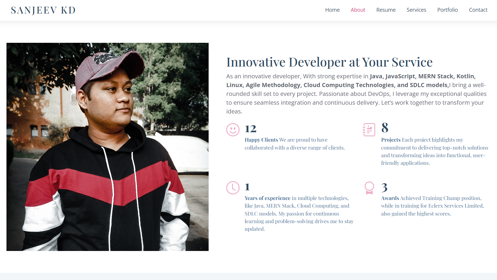

# Portfolio Website

Welcome to my portfolio website! This project showcases my skills and projects using HTML, CSS, JavaScript, and Bootstrap. It serves as a personal portfolio to highlight my work and experience.

## Preview



You can view the live preview of the website here [Portfolio-Website](https://sanjeev-live.netlify.app).

## Features

- **Responsive Design:** The website is fully responsive and works on all devices, from desktops to mobile phones.
- **Modern UI:** Designed with Bootstrap for a sleek and professional look.
- **Interactive Elements:** Includes animations and transitions for a dynamic user experience.
- **Project Showcase:** Displays my projects with details and links to their respective repositories.
- **Contact Form:** Visitors can get in touch with me through the contact form.

## Technologies Used

- **HTML5**: For structuring the web pages.
- **CSS3**: For styling the website and creating layouts.
- **JavaScript**: For interactive features and DOM manipulation.
- **Bootstrap**: For responsive design and UI components.

## Setup and Installation

To run this project locally, follow these steps:

1. **Clone the repository:**
   ```bash
   git clone https://github.com/yourusername/portfolio-website.git
   ```
2. **Navigate to the project directory:**
    ```bash
   cd portfolio-website
   ```
3. **Open index.html in your browser:**
    ```bash
   You can simply open the 'index.html' file in a web browser to view the website.
   ```


## Contact
Feel free to reach out if you have any questions or feedback. You can contact me at <br> Email : Crisiscrush525@gmail.com.
<br> Contact : 7018021841